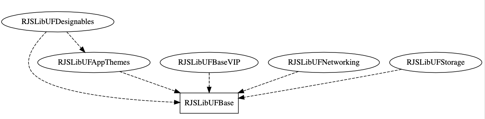

# RJSLibUF

__Guys love tools, this is my Swift toolbox (UIKit and Foundation )__

<p align="center">
   <a href="https://developer.apple.com/swift/">
      
   </a>
    <a href="https://developer.apple.com/swift/">
      
   </a>
   <a href="">
      
   </a>
   <br/>
   <a href="https://github.com/Carthage/Carthage">
      
   </a>
   <a href="https://github.com/apple/swift-package-manager">
      
   </a>
   <a href="https://twitter.com/ricardo_psantos/">
      
   </a>
</p>


# Library Organization

There are 5 frameworks separated by business 




### RJSLibUFBase

RJSLibUFBase contains things like:

* Extensions
* Reachability manager
* App and device info utilities
* Generic utilities 
   * Chronometer
   * App Logger
   * Data types conversion tools
* Util classes
   * `SynchronizedArray`
* Others

---

### RJSLibUFAppThemes

_To do..._

---

### RJSLibUFALayouts

Auto-layout framework (supports constraints or anchors)

```swift
let label = UILabel()
let imageView = UIImageView()
self.view.addSubview(label)
self.view.addSubview(imageView)

label.rjsALayouts.setMargin(50, on: .top)
label.rjsALayouts.setMargin(50, on: .left)
label.rjsALayouts.setHeight(50)

imageView.rjsALayouts.setMargin(50, on: .top)
imageView.rjsALayouts.setMargin(50, on: .left, from: label)
imageView.rjsALayouts.setHeight(50)
```

---

### RJSLibUFNetworking

RJSLibUFNetworking allow you to do things like:

__Model:__

```swift
struct Employee: Codable {
    // https://app.quicktype.io/
    let identifier, employeeName, employeeSalary, employeeAge: String
    let profileImage: String
    enum CodingKeys: String, CodingKey {
        case identifier     = "id"
        case employeeName   = "employee_name"
        case employeeSalary = "employee_salary"
        case employeeAge    = "employee_age"
        case profileImage   = "profile_image"
    }
}
```

__API Target Request:__

```swift
struct APIRequest: RJS_SimpleNetworkClientRequestProtocol {
    var returnOnMainTread: Bool = false
    var debugRequest: Bool = true
    var urlRequest: URLRequest
    var responseType: RJS_SimpleNetworkClientResponseType
    var mockedData: String? = """
[{"id":"36253","employee_name":"Mike Cooper","employee_salary":"80","employee_age":"23","profile_image":""},{"id":"36255","employee_name":"Eldon","employee_salary":"9452","employee_age":"66","profile_image":""}]
"""
    init() throws {
        if let url = URL(string: "http://dummy.restapiexample.com/api/v1/employees") {
            urlRequest            = URLRequest(url: url)
            urlRequest.httpMethod = RJS_SimpleNetworkClient.HttpMethod.get.rawValue
            responseType          = .json
        } else {
            throw NSError(domain: "com.example.error", code: 0, userInfo: nil)
        }
    }
}
```

__Request:__

```swift
do {
    typealias EmployeeList = [Employee]
    let apiRequest: RJS_SimpleNetworkClientRequestProtocol = try APIRequest()
    let api: SimpleNetworkClient_Protocol = RJS_SimpleNetworkClient()
    api.execute(request: apiRequest, completionHandler: { (result: Result<RJS_SimpleNetworkClientResponse<EmployeeList>>) in
        switch result {
        case .success(let some): print(some.entity)
        case .failure(let error): print(error)
        }
    })
} catch {
    print(error)
}
}
```

---

### RJSLibUFStorage

RJSLibUFStorage includes storage helpers for:

* File handling
* CoreData
* Keychain
* NSUserDefaults utils
* Caching 
   * Hot cache using NSCache
   * Cold cache using CoreData

# Install

### Install via Carthage

[Carthage](https://github.com/Carthage/Carthage) is a decentralized dependency manager that builds your dependencies and provides you with binary frameworks.

You can install Carthage with [Homebrew](http://brew.sh/) using the following command:

```bash
$ brew update
$ brew install carthage
```

To integrate RJPSLibUB into your Xcode project using Carthage, specify it in your `Cartfile`:

```ogdl
github "ricardopsantos/RJSLibUF" "1.2.4"
```

or for beta

```ogdl
github "ricardopsantos/RJSLibUF" "master"
```

---

### Swift Package Manager

__Install using SPM On Xcode__

Add the following to your Package.swift file's dependencies:

`.package(url: "https://github.com/ricardopsantos/RJSLibUF.git", from: "1.2.4")`

And then import wherever needed


---

__Install using SPM on XcodeGen__

```yml
packages:
  RJSLibUF:
    url: https://github.com/ricardopsantos/RJSLibUF
    branch: master
    #minVersion: 1.0.0, maxVersion: 2.0.0
    
targets:
  YourAppTargetName:
    type: application
    platform: iOS
    deploymentTarget: "13.0"
    sources:
       - path: ../YourAppSourcePath
    dependencies:
      - package: RJSLibUF
        product: RJSLibUFBase
        product: RJSLibUFStorage
        product: RJSLibUFNetworking
        product: RJSLibUFALayouts
        product: RJSLibUFAppThemes
```

---

__Install dependency on other SPM packages__

* Add the package `.package(name: "rjps-lib-uf", url: "https://github.com/ricardopsantos/RJSLibUF", from: "1.2.4")` (line 28)
* Declare the dependecies (line 14 and 19)
* Add the dependency
* 


---      
        
__SPM Generic Usage__


